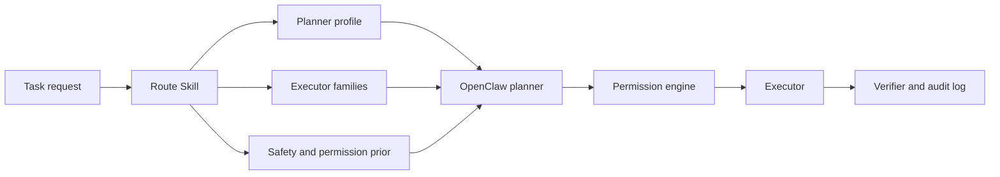

# OpenClaw Task Router

Deterministic, auditable planner routing for OpenClaw.

[](https://github.com/RTPI-ltc/route-openclaw-task/actions/workflows/ci.yml)
[](https://github.com/RTPI-ltc/route-openclaw-task/actions/workflows/openclaw-compat.yml)
[](https://github.com/RTPI-ltc/route-openclaw-task/actions/workflows/codeql.yml)
[](LICENSE)
[](https://www.python.org/)
[](https://agentskills.io/)

[中文说明](README.zh-CN.md) | [Integrations](docs/INTEGRATIONS.md) | [Benchmarks](docs/BENCHMARKS.md) | [Security](SECURITY.md) | [Architecture](docs/ARCHITECTURE.md)

`route-openclaw-task` turns a natural-language task into a bounded JSON routing decision before any tool runs. It selects a planner profile, executor family, context policy, permission behavior, and next action while preserving OpenClaw's runtime permission engine as the final authority.

It is a router, not a command generator.

## Why This Exists

Generative planners are good at proposing actions, but tool selection becomes fragile when a task exposes many similar interfaces, distraction tools, or incomplete dependencies. This skill adds a small deterministic layer that is:

- **Fast:** about 1.3 ms per ToolSandbox task on the published benchmark host.
- **Auditable:** every decision includes signals, confidence, policy, and a reason.
- **Offline:** Python standard library only; no network or API key.
- **Guarded:** never bypasses OpenClaw permissions or turns off a safety guard.
- **Tested:** paired baseline/optimized evaluation with held-out task groups.

## Results

### OpenClaw + Qwen3.7-Max, 258 New ToolSandbox Tasks

| Metric | Baseline | With Skill | Change |
|---|---:|---:|---:|
| Strict route success | 26.74% | **93.02%** | **+66.28 pp** |
| Holdout route success | 30.43% | **84.78%** | **+54.35 pp** |
| Executor coverage | 36.43% | **98.06%** | **+61.63 pp** |
| Executor precision | 65.50% | **100.00%** | **+34.50 pp** |
| Safety | 100.00% | **100.00%** | 0.00 pp |
| Mean latency | 34.27 s | 34.53 s | +0.76% |

The same model, image, planner policy, and security controls were used on both sides. The only optimized-container switch was the workspace skill. See [the full methodology and limitations](docs/BENCHMARKS.md).

### Standalone Router

- ToolSandbox: **93.41%** task-route success, **84.78%** holdout, 100% schema validity.
- 1,000-task generalization suite: **99.90%** task-route success, **100.00%** holdout.

## Install

### From GitHub

```bash
openclaw skills install git:RTPI-ltc/route-openclaw-task@v0.2.0
```

OpenClaw installs Git skills into the active workspace's `skills/` directory. Pin a release tag in production instead of tracking `main`.

### From a Local Clone

```bash
git clone https://github.com/RTPI-ltc/route-openclaw-task.git
openclaw skills install ./route-openclaw-task
```

Requirements: OpenClaw, Python 3.10 or newer, and no third-party Python packages. The release is install-and-run tested against the official OpenClaw `2026.6.11` image in a network-disabled, read-only-root container.

### Native Runtime Integration

The v0.2 release also ships a version-constrained OpenClaw native plugin. It
routes every prompt through the unchanged core before planning and falls back
to the baseline planner on any adapter error:

```bash
openclaw plugins install ./route-openclaw-task-openclaw-native-v0.2.0.tar.gz
openclaw plugins inspect route-openclaw-task --runtime --json
```

Codex and Claude Code plugin bundles are published from the same core. Their
v0.2 evidence is offline contract E2E only: Codex was not modified or invoked,
and Claude Code was not installed or started. See the precise
[compatibility matrix and evidence levels](docs/INTEGRATIONS.md).

## 60-Second Demo

```bash
python3 scripts/route_task.py \
  --goal "Add Ada to contacts. Available tool interfaces: add_contact, search_stock, get_wifi_status." \
  --pretty
```

```json
{
  "planner_profile": "api_planning",
  "execution_tools": ["mcp_tool_runner"],
  "primary_executor": "mcp_tool_runner",
  "policy_mode": "act",
  "permission_behavior": "ask",
  "next_action": "await_human",
  "safety_guard": false
}
```

The actual response also contains confidence, routing signals, context policy, planned tools, and an audit reason. See [the stable output contract](references/routing-contract.md).

## Batch Routing

```bash
python3 scripts/route_task.py \
  --input-jsonl examples/tasks.jsonl \
  --output-jsonl routes.jsonl

python3 scripts/validate_route.py routes.jsonl
```

## How It Fits OpenClaw



The skill returns advisory policy. OpenClaw still owns candidate generation, search, permission decisions, execution, and verification. The portable native plugin and the separately version-locked `LocalAuditPlanner` research adapter are documented in [OpenClaw integration](docs/OPENCLAW_INTEGRATION.md).

## Security

- No subprocess, shell, network, dynamic download, or credential access in the router.
- Models are JSON token-count tables, not executable weights.
- Public model artifacts exclude raw prompts and pass sensitive-literal scanning.
- Incomplete tool dependencies cause abstention/replanning instead of guessing.
- Mutation and production routes stay subject to OpenClaw confirmation policy.

Read [SECURITY.md](SECURITY.md) before connecting the skill to privileged tools.

## Development

```bash
python3 -m unittest discover -s tests -v
python3 scripts/validate_skill.py .
python3 scripts/verify_release.py .
python3 scripts/build_integrations.py
python3 scripts/validate_integrations.py
```

CI runs these checks on Python 3.10 through 3.13. Pull requests must include a routing test for behavior changes and must keep benchmark promotion gates green.

## Project Layout

```text
SKILL.md                 Agent-facing workflow and trigger metadata
scripts/route_task.py    Deterministic router and CLI
assets/                  Auditable Naive Bayes model tables
references/              Routing contract and model card
tests/                   Offline unit, CLI, invariant, and packaging tests
docs/                    Architecture, integration, and benchmark details
integrations/            Host manifests and thin adapter templates
examples/                Safe synthetic input examples
```

## Contributing

See [CONTRIBUTING.md](CONTRIBUTING.md). Security reports should follow [SECURITY.md](SECURITY.md), not public issues.

## License

Code and project-authored content are released under the [MIT License](LICENSE). Training sources and benchmark references retain their original licenses; see [THIRD_PARTY_NOTICES.md](THIRD_PARTY_NOTICES.md) and the [model card](references/model-card.md).
